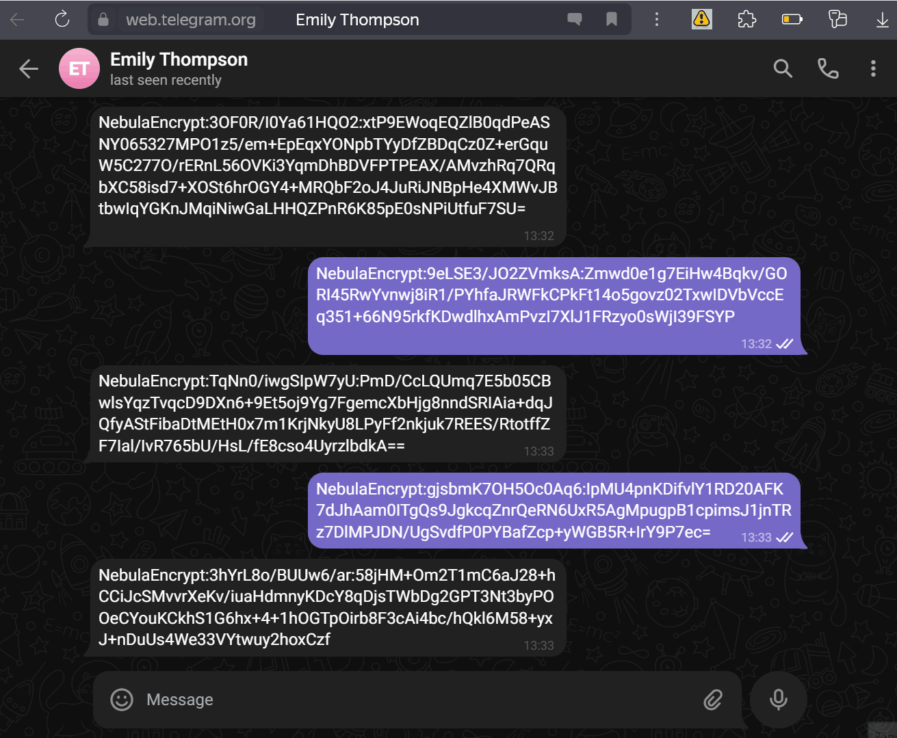

# NebulaEncrypt - Chrome Extension for Secure Local Encryption on the Web

  

NebulaEncrypt is a Chrome extension that ensures your messages on [Telegram Web](https://web.telegram.org) are encrypted and decrypted locally on your device. This guarantees that your communications remain private, with encryption keys stored exclusively on your computer.

> Disclaimer: This project is only for personal learning and communication, please do not use it for illegal purposes, please do not use it in a production environment

## Key Features

- **Local-Only Encryption**: All encryption and decryption processes occur directly on your device. Your encryption keys are never transmitted over the network.
- **Per-URL Key Configuration**: Customize encryption keys for different websites. The extension applies the correct key based on the URL of the active tab.
- **Automatic and Manual Encryption/Decryption**: Encrypt and decrypt messages with hotkeys or automatically based on the URL settings.
- **Real-Time Operation**: Messages are processed in real-time without interrupting your workflow.
- **Service-Specific DOM Handling**: Supports Telegram Web, with the ability to extend to other services by customizing DOM element selection.

## Quick Start

### Installation

1. Download or clone the repository.
2. In Chrome, go to `chrome://extensions/`.
3. Enable "Developer mode" and click "Load unpacked".
4. Select the folder containing the extension files.

### Usage

1. **Set Up Keys**: Click the extension icon and enter encryption keys for specific URLs. The extension will use these keys automatically when you visit the corresponding websites.
2. **Encrypt Messages**: Write your message in the input field on Telegram Web and press `Ctrl+Q` to encrypt before sending.
3. **Decrypt Messages**: Incoming encrypted messages are automatically decrypted if the correct key is configured for the current URL.

### Hotkeys

- **Encrypt Text**: `Ctrl+Q` - Encrypts text in the input field before sending.
- **Decrypt All Messages**: `Ctrl+X` - Manually decrypts all received encrypted messages.

## Technical Details

- **AES-GCM Encryption**: Utilizes the AES-GCM algorithm, performed entirely on your device.
- **Local Key Storage**: Keys are securely stored on your device and never leave it.
- **Dynamic Service Support**: Automatically detects and applies the correct encryption settings based on the active service (currently supporting Telegram Web).

## Troubleshooting

- **Message Not Encrypted**: Ensure the correct URL is associated with the appropriate encryption keys in the extension settings.
- **Decryption Issues**: Verify that the correct key is set for the current URL. Without the correct key, decryption is impossible.

## Contributing

We welcome contributions to expand NebulaEncrypt to other web services. Fork the repository and submit a pull request to help extend secure messaging across the web.

## License

This project is licensed under the MIT License - see the [LICENSE](LICENSE) file for details.

---

**Protect your online communications with NebulaEncrypt. Your privacy, your control.**
