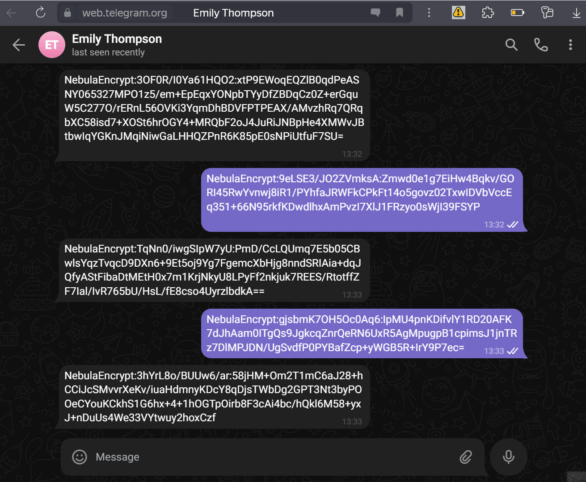

# NebulaEncrypt — браузерное расширение для локального шифрования в веб-чатах

  

NebulaEncrypt — расширение для Chrome/Chromium и Firefox для локального шифрования и расшифровки сообщений в [Telegram Web](https://web.telegram.org) и [MAX](https://web.max.ru). Все операции выполняются на вашем устройстве, ключи не покидают компьютер.

> **Важно:** проект предназначен только для личного обучения и общения. Не используйте в незаконных целях и не полагайтесь на него в production.

## Основные возможности

- **Только локальное шифрование** — шифрование и расшифровка на устройстве, ключи не передаются по сети.
- **Ключи по URL** — отдельные ключи для каждого сайта (Telegram, MAX); расширение подставляет нужный ключ по адресу вкладки.
- **Два ключа** — «ваш ключ» (для исходящих сообщений) и «ключ собеседника» (для входящих).
- **Соль по URL** — один и тот же пароль на разных сайтах даёт разные ключи (PBKDF2 с уникальной солью).
- **Шифрование и расшифровка** — горячие клавиши, кнопки в попапе и автоматическая расшифровка при появлении сообщений.
- **Поддержка сервисов** — Telegram Web (A и K) и MAX; автоопределение версии/сайта, ключи хранятся по домену.
- **Click-to-decrypt** — зашифрованные сообщения в ленте помечаются; по клику расшифровываются при настроенных ключах.
- **Защищённый экспорт и импорт ключей** — резервная копия сохраняется в JSON, зашифрованном отдельным паролем.
- **Индикатор в иконке** — зелёный «✓», если для текущего сайта есть ключи; оранжевый «!», если ключей нет. Счётчик расшифрованных сообщений.
- **Тёмная и светлая тема** — попап подстраивается под системную тему.

## Установка в Chrome / Chromium

1. Скачайте или клонируйте репозиторий.
2. В Chrome откройте `chrome://extensions/`.
3. Включите «Режим разработчика» и нажмите «Загрузить распакованное расширение».
4. Укажите папку с файлами расширения.

## Установка в Firefox

1. Откройте `about:debugging#/runtime/this-firefox`.
2. Нажмите «Загрузить временное дополнение».
3. Выберите `manifest.json` из папки проекта.

Для Manifest V3 используется кросс-браузерный фон: Chrome запускает `background.service_worker`, Firefox 121+ запускает `background.scripts`.

## Использование

1. **Настройка ключей**  
   Нажмите на иконку расширения. Выберите сервис (Telegram или MAX) или откройте нужную вкладку — URL подставится автоматически. Для каждой стороны сгенерируйте отдельный случайный ключ кнопкой (✦), передайте его собеседнику по независимому доверенному каналу и нажмите «Сохранить ключи». Ваш ключ шифрует исходящие сообщения; ключ собеседника расшифровывает входящие. При ручном вводе требуется не меньше 16 символов, но длина сама по себе не гарантирует стойкости.

2. **Шифрование**  
   Введите текст в поле ввода чата и нажмите горячую клавишу или кнопку «Зашифровать» в попапе. Текст в поле заменится на зашифрованный; отправьте сообщение как обычно.

3. **Расшифровка**  
   Новые зашифрованные сообщения расшифровываются автоматически. Можно нажать горячую клавишу или кнопку «Расшифровать» в попапе. Сообщения, которые ещё не расшифрованы, помечены в ленте — нажмите по ним для расшифровки (click-to-decrypt).

4. **Экспорт/импорт**  
   В попапе введите отдельный случайный пароль резервной копии длиной не менее 16 символов. «Экспорт бэкапа» скачивает `nebula-encrypt-backup.json` с ключами, зашифрованными AES-GCM. «Импорт бэкапа» расшифровывает файл тем же паролем и добавляет корректные записи к уже сохранённым. Бэкапы прежнего формата v1 и старые plaintext JSON-файлы импортируются для совместимости; новые бэкапы создаются только в зашифрованном формате v2.

## Горячие клавиши

| Действие              | Windows/Linux   | macOS        |
|-----------------------|-----------------|-------------|
| Зашифровать текст     | `Ctrl+Alt+E`    | `Ctrl+Shift+E` |
| Расшифровать сообщения | `Ctrl+Alt+D`  | `Ctrl+Shift+D` |

Сочетания можно изменить в `chrome://extensions/` → «Сочетания клавиш» для NebulaEncrypt.

## Технические детали

- **Новые сообщения:** формат `NebulaEncrypt:v3:<salt>:<iv>:<ciphertext>`. AES-256-GCM с 128-битным тегом, новая случайная соль 128 бит и IV 96 бит для каждого сообщения; ключ выводится через PBKDF2-HMAC-SHA-256 с 600 000 итераций. Адрес сайта и версия формата аутентифицируются как дополнительные данные AES-GCM.
- **Старые сообщения:** читаются прежние варианты с 210 000 или 100 000 итераций и фиксированной солью. Новые сообщения v3 требуют обновлённого расширения у обоих участников.
- **Хранение ключей:** только в `chrome.storage.local` на устройстве.
- **Резервные копии:** AES-GCM с ключом из пароля бэкапа через PBKDF2-HMAC-SHA-256, 600 000 итераций, случайная соль и IV. Старые бэкапы с 210 000 итераций читаются.
- **Сервисы и DOM:** автоопределение Telegram (A/K) и MAX; отдельные селекторы для полей ввода и пузырьков сообщений (в т.ч. Lexical-редактор в MAX).
- **Бейдж:** при смене вкладки/загрузке страницы проверяется наличие ключей для текущего URL; при расшифровке обновляется счётчик в бейдже.

## Границы защиты

- Сам шифротекст не раскрывает исходный текст тому, кто видит только сохранённое сообщение. Исходный текст перед шифрованием находится в поле ввода сайта, а автоматически расшифрованный текст вставляется в DOM страницы. Скрипты сайта, другие расширения с доступом к странице и локальное вредоносное ПО могут прочитать этот открытый текст. Поэтому расширение не скрывает открытый текст от самого веб-приложения.
- Ключи хранятся в локальном хранилище браузерного расширения без отдельного шифрования на диске. Защитите профиль браузера и устройство. Расширение не обеспечивает сквозную защиту при компрометации устройства или сайта.
- Общие секреты действуют для всего сайта, а не для конкретного чата. Участник с ключом может создать или повторно отправить сообщение; шифротекст не доказывает личность отправителя. Компрометация ключа раскрывает и старые сообщения. Для разных собеседников нужны разные секреты, однако текущая версия хранит лишь одну пару ключей на сайт.
- Слабые или повторно использованные пароли могут быть подобраны по перехваченному шифротексту. Предпочитайте ключи, созданные встроенным генератором. При обновлении расширения перезагрузите открытые вкладки чатов.
- В версии 1.0 после неудачной расшифровки в атрибут страницы записывался SHA-256 отпечаток ключа. Сайт мог прочитать его и быстро подбирать слабые ключи. Если использовались вручную придуманные или повторно использованные ключи, замените их; для доступа к старым сообщениям сначала сохраните прежние ключи в защищённой резервной копии.

## Устранение неполадок

- **Сообщение не шифруется** — убедитесь, что для текущего URL сохранены ключи (иконка зелёная). Откройте чат и снова нажмите «Зашифровать» или горячую клавишу.
- **Не расшифровывается** — проверьте, что для этого сайта сохранён правильный «ключ собеседника». Без него расшифровка невозможна.
- **«Поле ввода не найдено»** — откройте конкретный чат и убедитесь, что страница полностью загружена; при необходимости перезагрузите вкладку.
- **«Перезагрузите страницу»** — после установки или обновления расширения перезагрузите страницу Telegram/MAX.

## Структура проекта

- `manifest.json` — манифест расширения (Manifest V3), разрешения, команды, content script для Telegram и MAX, настройки Firefox.
- `extension-api.js` — тонкий слой совместимости `browser.*`/`chrome.*` для Firefox и Chromium.
- `popup.html` / `popup.js` — попап: выбор сервиса, URL, два ключа, генератор ключей, экспорт/импорт, список сохранённых сайтов, кнопки шифровать/расшифровать.
- `background.js` — обработка горячих клавиш, уведомления, обновление бейджа (наличие ключей и счётчик).
- `content.js` — определение сервиса, работа с DOM, шифрование/расшифровка, click-to-decrypt, наблюдатель за новыми сообщениями.
- `message-crypto.js` — версия формата сообщений, AES-GCM, вывод ключей и чтение старых сообщений.
- `tests/crypto.test.js` — проверки шифрования, изменения шифротекста и совместимости; запуск: `node --test tests/crypto.test.js`.

## Лицензия

Проект распространяется под лицензией MIT — см. файл [LICENSE](LICENSE).

---

**NebulaEncrypt — шифрование в веб-чатах под вашим контролем.**
